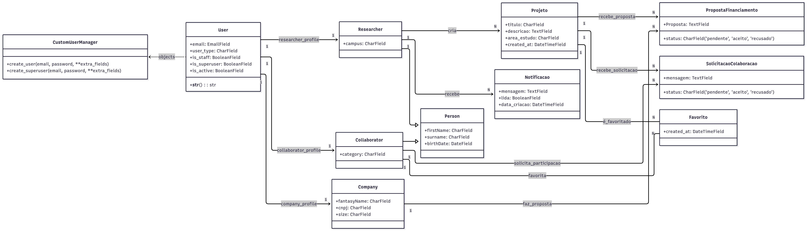
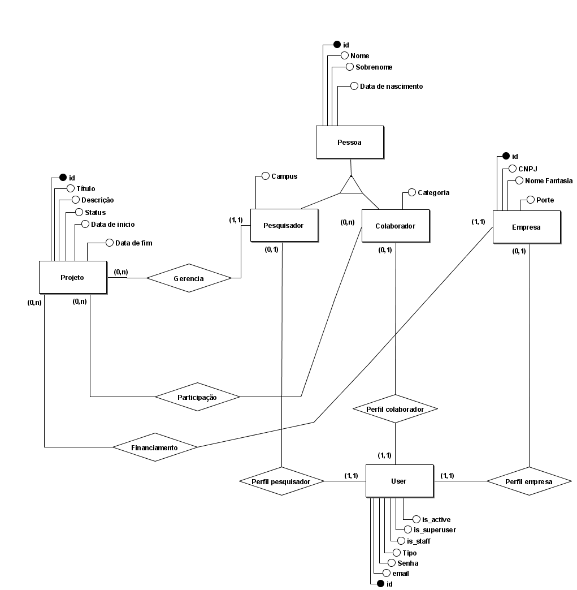

# Documento de Arquitetura

## Histórico de Versão

| Data       | Versão | Descrição                                | Autor(es)      |
| ---------- | ------ | ---------------------------------------- | -------------- |
| 1/11/2025 | 1.0    | Criação do documento de arquitetura      | Pedro Vargas, Thiago Gomes   |

---

## 1 Introdução

### 1.1 Finalidade
Este documento tem como finalidade descrever a arquitetura de software do projeto Vitra, uma aplicação movél. A arquitetura descrita aqui serve serve como referência para orientar a equipe ao longo do projeto, servindo também como referência para os interessados.

### 1.2 Escopo
O **Vitra** é um aplicativo mobile desenvolvido por estudantes da **Universidade de Brasília (UnB)**, com o objetivo de servir como uma **vitrine de projetos** voltada para **pesquisadores, colaboradores e empresas**. Este documento descreve os aspectos técnicos essenciais da arquitetura do sistema, abrangendo tanto o **Frontend** quanto o **Microsserviço API**.

## 2 Representação da Arquitetura

### 2.1 Padrão Arquitetural

A arquitetura do **Vitra** adota uma abordagem baseada em **microsserviços**, composta por dois principais componentes independentes:  

- **Frontend:** Responsável pela interface e experiência do usuário no aplicativo móvel.  
- **Microsserviço API:** Responsável pela camada de backend e pela disponibilização dos serviços da aplicação.  

### 2.2 Diagrama de relacionamento

*Diagrama elaborado por Pedro Vargas, 2025*

### 2.3 Frontend

O **Frontend**, desenvolvido em **React Native**, atua como cliente da API REST. Ele representa a camada **View** da arquitetura global, sendo responsável por consumir os serviços oferecidos pelo backend e apresentar as informações de forma interativa ao usuário final.

### 2.4 Microsserviço API

No **Microsserviço API**, foi adotado o padrão arquitetural **MVC (Model-View-Controller)**, implementado por meio do **Django REST Framework**. Nesse modelo, as responsabilidades são bem definidas e desacopladas:

- **Model:** Representa a camada de dados e as regras de negócio, sendo responsável pela comunicação com o banco de dados **PostgreSQL**, que centraliza e persiste todas as informações da aplicação.  
- **View:** Corresponde às *views* do Django REST Framework, que expõem os dados e funcionalidades do sistema através de endpoints da API REST.  
- **Controller:** É representado pelos *serializers* e *viewsets*, que processam as requisições, aplicam regras de validação e intermediam a comunicação entre as views e os models.

Dessa forma, a comunicação entre o microsserviço e o frontend ocorre por meio de **requisições HTTP**, garantindo um **baixo acoplamento** entre as partes e facilitando a **escalabilidade**, **manutenção** e **evolução independente** de cada componente.

## 3 Metas e restrições arquiteturais

### 3.1 Metas arquiteturais

* **Acessibilidade:** O sistema deve ser acessível nas plataformas móveis (IOS e Android) através de um aplicativo nativo.

* **Manutenibilidade:** A arquitetura deve ajudar em fazer com que correções de bugs e implementação de novas features. A separação entre o Frontend(View) e API (Controller/Model) é a principal forma para atingir essa meta.

* **Testabilidade:** Facilitar a implementação de testes unitários e automatizados de forma isolada para o frontend e backend.

* **Segurança:** Garantir requisitos de segurança para a autenticação de usuários e autoriazação baseada nos diferentes perfis.

### 3.2 Requisitos Arquiteturais

| **Restrição**|**Ferramenta**|
|--------------|--------------|
| Frontend (Linguagem) | TypeScript |
| Frontend (Framework) | React Native e Expo|
| Backend (Linguagem) | Python
| Backend (Framework) | Django e Django Rest( para API)
| Banco de Dados | PostgreSQL
| Plataforma | Mobile |
| Segurança | Cada usuário contará com uma conta autenticada via token (django-authtoken), visto que o aplicativo dará suporte para criação de cadastros personalizados. |

## 4 Backlog do produto

Funcionamento: O aplicativo **Vitra** tem como objetivo fornecer maior acessibilidade e melhor visualização e navegação para pesquisas acadêmicas que estão em curso na Universidade de Brasília (UNB). Para isso, o sistema permite que os usuários se cadastrem e escolham entre três tipos de perfil (Pesquisador, Colaborador ou Empresa) ou ainda apenas o modo de visualização, definindo assim a experiência inicial dentro do aplicativo. Após realizar o login, o usuário pode visualizar informações sobre pesquisas, criar ou apoiar pesquisas e entrar em contato com pesquisadores, dependendo de sua função.

Influência na Arquitetura: A arquitetura escolhida foi a Microsserviço API, principalmente por permitir uma melhor organização entre múltiplos papéis com permissões distintas. Por exemplo, apenas "Empresas" podem fazer propostas financeiras e apenas "Pesquisadores" podem criar projetos. A escolha de uma arquitetura com uma API desacoplada (Microsserviço API) foi a solução direta para esse requisito. Ela permite centralizar 100% da lógica de autorização e permissão no backend (Camada Controller), expondo ao Frontend (Camada View) apenas os dados e ações permitidos para aquele usuário específico, garantindo a segurança e a integridade das regras de negócio.

Entre os fatores que influenciaram a escolha do padrão de arquitetura, destacam-se:

* Suporte a dispositivos móveis (Android e iOS), viabilizado pelo uso do React Native;

* Necessidade de autenticação e controle centralizado de usuários;

* Facilidade na manutenção e expansão do sistema;

* Definição clara das responsabilidades entre os componentes.

## 5 Implementação

### 5.1 Visão lógica

#### 5.1.1 Visão geral:

- **Camada de Interface:** Responsável pela interação com o usuário, desenvolvida em **React Native**  
- **Camada de API:** Conjunto de endpoints **REST** disponibilizados pelo backend para comunicação com o aplicativo  
- **Camada de Serviços:** Onde estão as regras de negócio e o tratamento das informações  
- **Camada de Banco de Dados:** Encapsula a persistência e a manipulação dos dados no banco de dados  

### 5.1.2 Componentes Principais

#### Frontend (ReactNative com TypeScript)

O frontend do **Vitra** foi construído utilizando **React Native** em conjunto com **TypeScript**, permitindo a criação de telas no aplicativo com tipagem estática. Essa combinação garante a identificação de erros durante a compilação, melhora a legibilidade e documentação do código, além de oferecer suporte à autocompletação no ambiente de desenvolvimento. A arquitetura é organizada de maneira modular, facilitando tanto a evolução quanto a manutenção do projeto.

#### Estrutura de Diretórios:

- **Mobile:** Diretório raiz do projeto Frontend em React Native (gerenciado com Expo)  
- **app:** Contém as telas e rotas principais da aplicação  
- **assets/Images:** Armazena as imagens e outros arquivos de mídia utilizados na interface  
- **components:** Contém os componentes reutilizáveis da interface, como botões, campos de texto e menus  
- **utils:** Reúne funções utilitárias, como formatações e validações usadas em várias partes do app  
- **app.json:** Arquivo de configuração do Expo, definindo nome, ícone, splash screen e permissões do aplicativo  
- **eslint.config.js:** Define as regras de linting e padronização do código  
- **package-lock.json:** Registra as versões exatas das dependências instaladas para garantir consistência  
- **package.json:** Define as dependências, scripts e metadados do projeto  
- **tsconfig.json:** Configuração do TypeScript, especificando as opções de compilação e checagem de tipos  

#### Backend (Django Rest Framework)

O backend do Vitra é desenvolvido com o Django Rest Framework e adota uma arquitetura modular, que prioriza a separação clara de responsabilidades. Sua estrutura é composta por módulos principais e segue um padrão organizado de diretórios.

#### Estrutura de Diretórios:

- **API:** Diretório raiz do projeto Django
- **api:** Aplicativo Django responsável pela lógica de API  
- **core:** Configurações centrais do projeto Django  
- **django.sh:** Arquivos para auxílio na instalação ou inicialização do software (Script customizado).
- **docker-compose.yml:** Arquivo com arquivos do Docker para orquestração de serviços.
- **Dockerfile:** Arquivo de configuração Docker para construir a imagem da aplicação.
- **manage.py:** Arquivo criado automaticamente para gerenciamento de comandos (execução de servidor, migrações, etc.).
- **requirements.txt:** Organiza todos os pacotes/componentes que a aplicação utiliza.  

#### Diagrama de classes

*Modelo elaborado por Pedro Vargas, 2025*

### 5.2 Visão de dados (MER)

O Modelo Entidade-Relacionameto (MER) foi feito para ajudar a orientar o grupo a modelar e desenolver o banco de dados. Ele define as entidades, seus atributos e os relacionamentos entre elas, garantindo a integridade e a consistência de nosso banco de dados.

*Modelo elaborado por Pedro Vargas, 2025*

### 5.3 Visão de implementação
O software será implantado em ambiente de desenvolvimento local (localhost), com a devida configuração da infraestrutura de software e dos parâmetros necessários para sua execução.

#### 5.3.1 Descrição da Infraestrutura de Implantação

- **Cliente (Frontend):** A aplicação será desenvolvida em React Native. Ela poderá ser executada tanto em emuladores de dispositivos móveis (como Android Studio e iOS Simulator) quanto em dispositivos físicos, por meio do aplicativo Expo Go.

- **Servidor (Backend):** A tecnologia do servidor será desenvolvida utilizando o framework de alto nível Django.

- **Comunicação:** Iremos utilizar a biblioteca Axios para fazer as requisições HTTP.

- **Armazenamento de dados:** O sistema utiliza PostgreSQL para armazenamento de dados.

- **Repositório:**: O código-fonte de todos os componentes (front-end e back-end) é gerenciado por meio de três repositórios: o de documentação (2025.2-Fuxi-Docs), o de front-end (2025.2-Fuxi-Mobile) e o de back-end (2025.2-Fuxi-API).

#### 5.3.2 Tecnologias de Implantação

- **Imprelentação Local**: Por se tratar de um projeto de pequeno porte, não houve necessidade de utilizar uma hospedagem mais complexa, o que também evitou custos adicionais com esse tipo de serviço.

- **Docker**: Garante que todos usem o mesmo banco de dados PostgreSQL e os mesmos serviços de back-end.

- **PostgreSQL:** Foi escolhido por ser mais fácil de implementar com o Django.

- **React Native:** Foi escolhido por ser uma opção que facilita a codificação para dispositivos móveis.

- **Django REST Framework:** Framework backend robusto e seguro. Sua arquitetura acelera a construção de APIs RESTful complexas, como necessitamos dados os mútltiplos perfis existentes.

